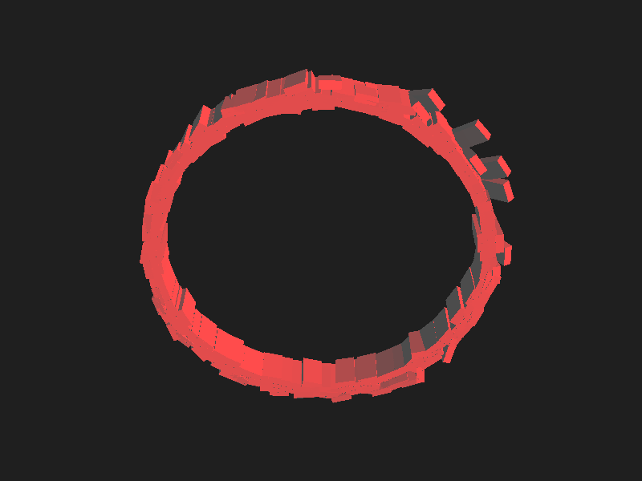
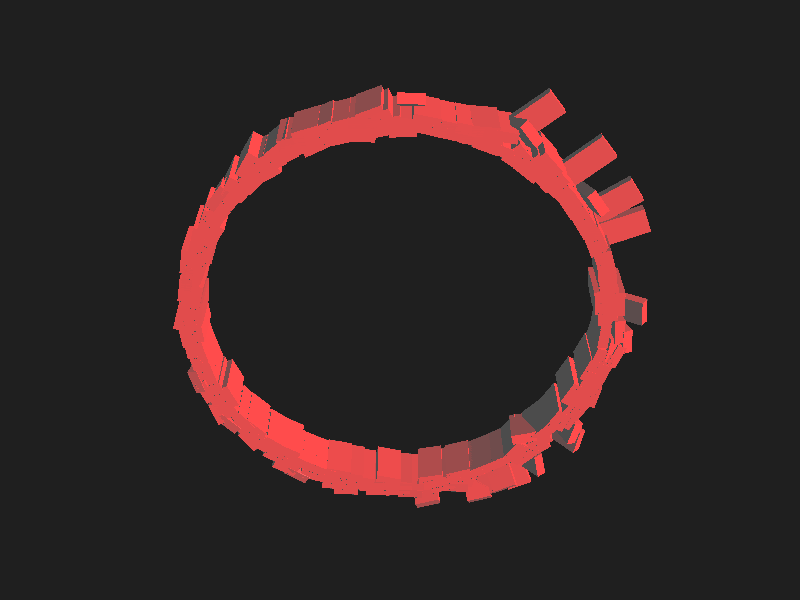
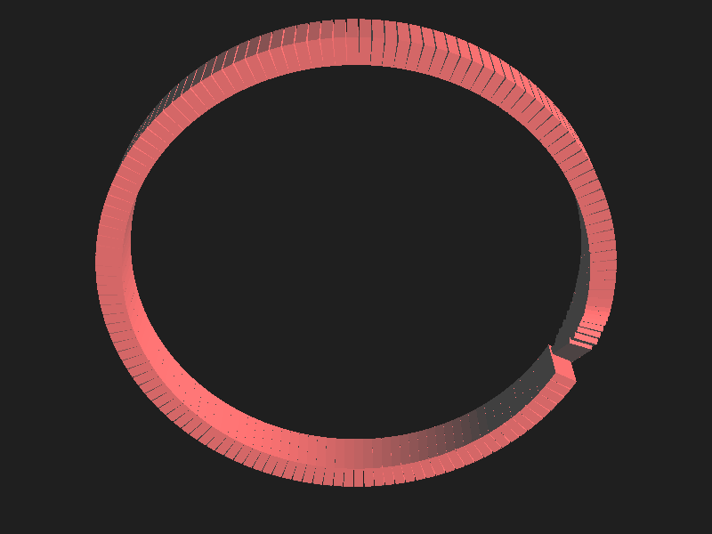
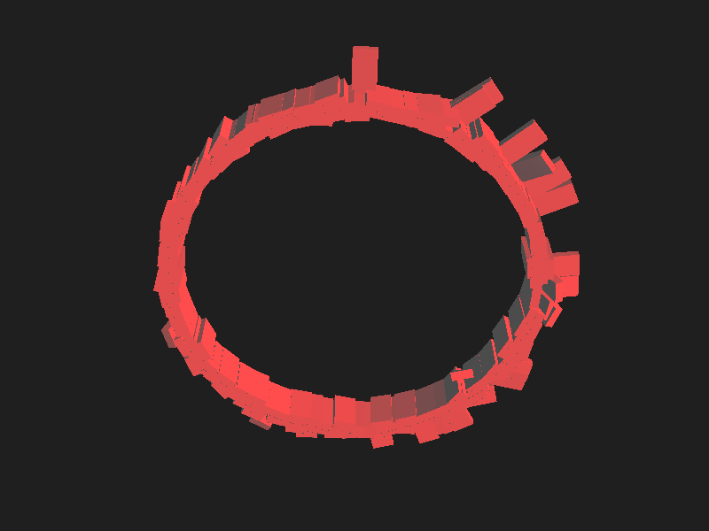

# magnum-domino-chain
C/C++ bullet physics simulation visualized with magnum.

This project is mainly based on the C/C++ libraries: 
grapic library https://magnum.graphics/ as well https://magnum.graphics/corrade/ for utility functions. 

For building magnum and corrade from scratch checkout the repo from https://github.com/mosra/magnum and https://magnum.graphics/corrade/.
Important: Build the corrade project before building the magnum project.

Building the corrade project:
 ```
cd corrade 
mkdir build && cd build
cmake ..
cmake --build .
 ```

Building the magnum project:
```
cd magnum
mkdir build && cd build
cmake ..\ 
   -DMAGNUM_WITH_SDL2APPLICATION=ON
 && make 
 && make install
```

After building the magnum project you can build this C/C++ project.

The game of life project has following order structure: 

```
./build
./CMakeLists.txt
./corrade -> ../../corrade/
./magnum -> ../../magnum/
./modules
./README.md
./src
```

Examples of Bullet Physics Simulation:






