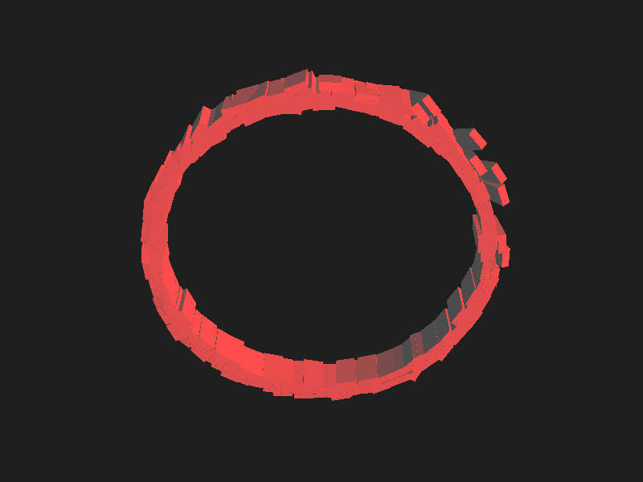
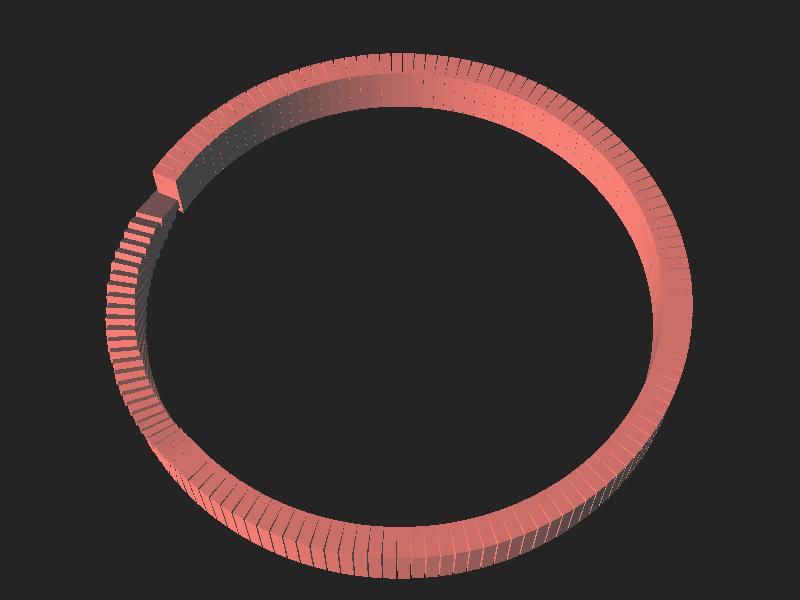
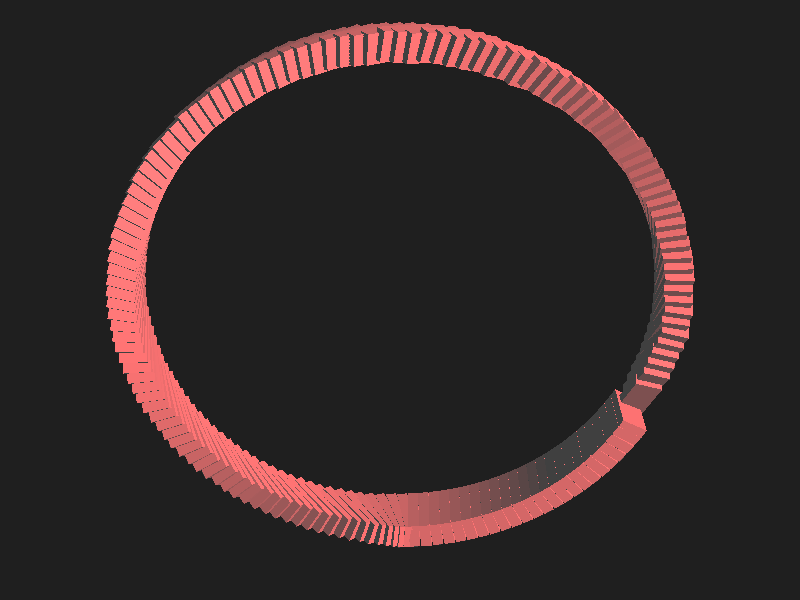
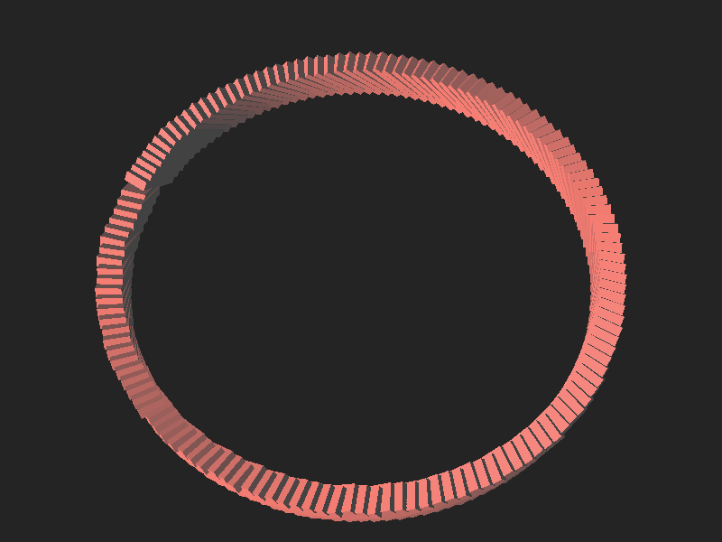

# Magnum Domino Chain

A real-time **domino chain simulation** built with **C++**, **Magnum**, and **Bullet Physics**.

The project demonstrates rigid-body physics, collision detection, collision response, and real-time 3D rendering by simulating a chain of falling dominoes.

---

## Features

* 🧱 Real-time domino chain simulation
* ⚙️ Bullet Physics rigid-body simulation
* 🎨 3D rendering with Magnum
* 💥 Collision detection and response
* 🔄 Configurable domino chain
* 🖥️ Interactive real-time visualization
* 🌐 OpenGL-based rendering

---

## Technologies

| Technology         | Purpose                                    |
| ------------------ | ------------------------------------------ |
| **C++**            | Application and simulation logic           |
| **Magnum**         | 3D rendering and application framework     |
| **Bullet Physics** | Rigid-body physics and collision detection |
| **OpenGL**         | Graphics rendering                         |
| **CMake**          | Build system                               |

---

## Simulation

Each domino is represented as a rigid body inside the Bullet Physics simulation.

The simulation handles:

* Gravity
* Linear movement
* Angular movement
* Collision detection
* Collision response
* Friction between objects

When the first domino falls, its collision transfers momentum to the next domino and creates the chain reaction.

---

## Architecture

The simulation consists of three main components:

```text
                   ┌──────────────────┐
                   │  Domino Setup    │
                   │ / Initialization │
                   └────────┬─────────┘
                            │
                            ▼
                   ┌──────────────────┐
                   │ Bullet Physics   │
                   │    Simulation    │
                   └────────┬─────────┘
                            │
                            ▼
                   ┌──────────────────┐
                   │ Magnum Rendering │
                   │    / OpenGL      │
                   └────────┬─────────┘
                            │
                            ▼
                      Real-time View
```

**Bullet Physics** is responsible for the physical simulation, while **Magnum** handles rendering and application-level graphics.

---

## Simulation Examples

Examples captured from the Bullet Physics simulation:

<table>
  <tr>
    <td align="center">
      
      <br>
      <b>Initial Chain Reaction</b>
    </td>
    <td align="center">
      
      <br>
      <b>Chain Reaction</b>
    </td>
  </tr>
  <tr>
    <td align="center">
      
      <br>
      <b>Simulation Progress</b>
    </td>
    <td align="center">
      
      <br>
      <b>Simulation Result</b>
    </td>
  </tr>
</table>

---

## Building

### Requirements

* C++ compiler with C++17 support
* CMake
* Magnum
* Corrade
* Bullet Physics
* OpenGL-compatible graphics environment

### Dependencies

The project uses **Magnum** and **Corrade** as its rendering and utility libraries.

For building Magnum and Corrade from source, obtain the corresponding projects and build **Corrade before Magnum**.

### Build Corrade

```bash
cd corrade
mkdir build
cd build
cmake ..
cmake --build .
```

### Build Magnum

```bash
cd magnum
mkdir build
cd build
cmake .. \
  -DMAGNUM_WITH_SDL2APPLICATION=ON

make
make install
```

After Magnum and Corrade have been built, the project itself can be compiled.

---

## Build the Project

Clone the repository:

```bash
git clone https://github.com/CodeByMaxx/magnum-domino-chain.git
cd magnum-domino-chain
```

Create a build directory:

```bash
mkdir build
cd build
```

Configure the project:

```bash
cmake ..
```

Build:

```bash
cmake --build .
```

---

## Project Structure

```text
magnum-domino-chain
│
├── build
├── CMakeLists.txt
├── corrade
├── magnum
├── modules
├── src
└── README.md
```

The `corrade` and `magnum` directories are used as dependencies for the project.

---

## Running

After building the project, start the generated executable from the build directory.

The application opens the real-time 3D simulation and visualizes the domino chain reaction.

---

## Project Goals

The project was created to explore the interaction between:

* Real-time rendering
* Rigid-body physics
* Collision detection
* C++ application development
* 3D graphics
* Simulation-driven visualization

It provides a compact example of combining a rendering framework with a physics engine in a real-time application.

---

## Future Improvements

Possible improvements include:

* [ ] Interactive domino placement
* [ ] Configurable domino spacing
* [ ] Different domino layouts
* [ ] Camera controls
* [ ] Additional physics parameters
* [ ] Performance improvements
* [ ] More complex chain configurations

---

## License

This project is licensed under the **MIT License**.

